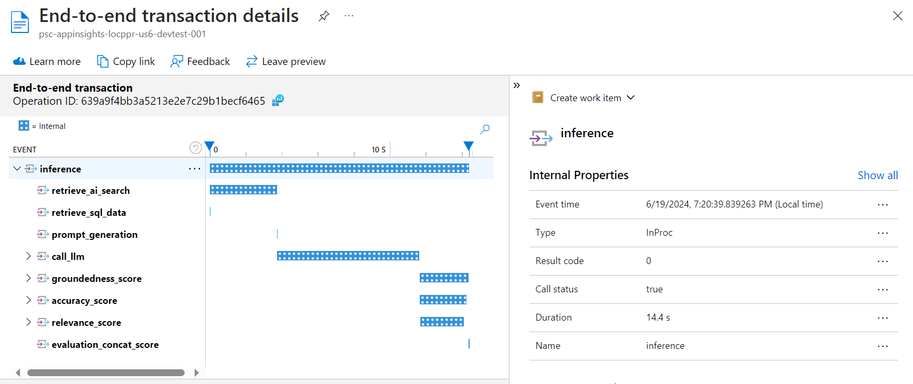
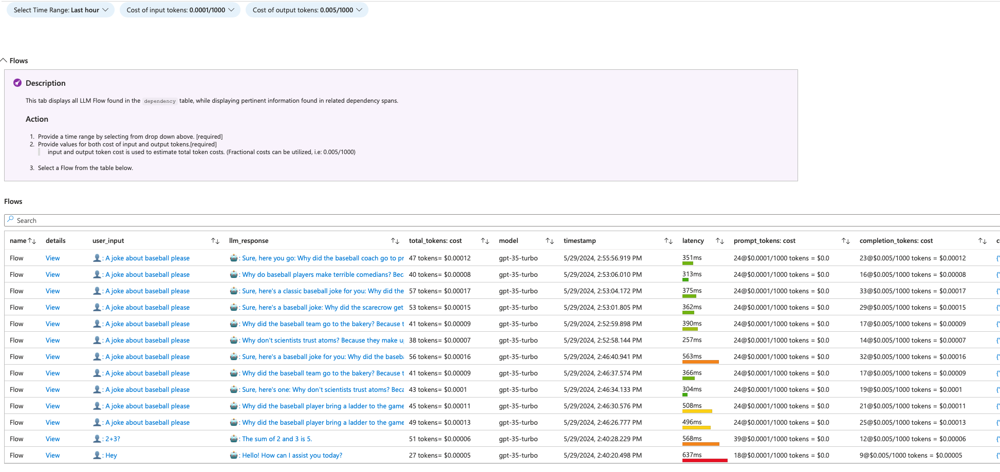
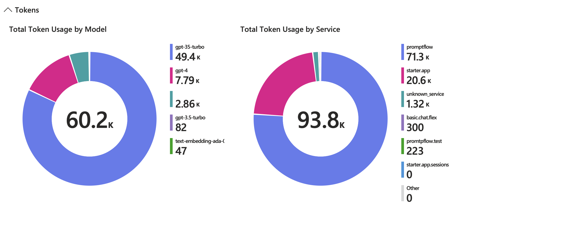
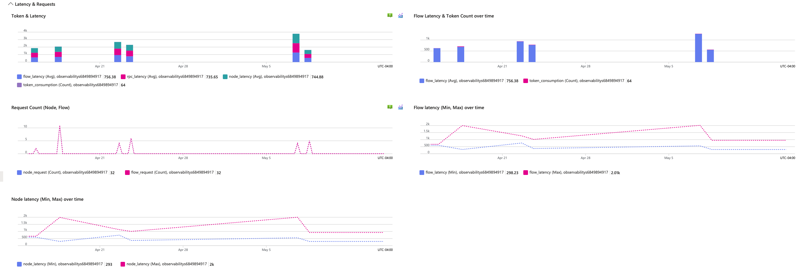

# 7. Observability in Prompt Flow

Date: 2024-06-19

## Status

Proposed

## Context

We want to improve observability of GenAI solutions built with Prompt Flow deployed as a container to App Service within the AIGA accelerator. We want to standardise the current ways of logging and tracing, define and embed best practices within the accelerator.
Embedding observability will allow the team to gain insights into the GenAI solution's operations, identify bugs and inefficiencies as well as compare versions of deployed Prompt Flow endpoint and the corresponding evaluation metrics.
The key areas to be addressed within this ADR are as follows:

1. **Traceability**: Document how to ensure that traces are captured from the web application to App Insights.
1. **Log Integration**: Document the selected approach to capturing logs within the trace data to be able to correlate events.
1. **Custom Metrics**: Document the agreed approach to capture GenAI solution evaluation metrics e.g. groundedness, relevance etc per flow run.
1. **Alerting**: Document the alerting mechanisms and the agreed implementation.
1. **Visualisations & Monitoring**: Document the approach to creating dashboards, workbooks to provide an overview of key metrics (especially token consumption) to facilitate proactive monitoring of the system.

The ultimate output of this initiative is to have a robust observability framework in place, leveraging Application Insights (App Insights), monitoring frameworks (e.g. MLFlow, OpenTelemetry), and other relevant technologies to provide a clear and actionable view of the system's health and performance.

Code Orange is strongly recommending the use of MLFlow registration for model and experiment for projects using the CO infra across all platforms (AML, Databricks, Domino), for an enterprise-wide tracing of the models being deployed. This however does not preclude the use of OpenTelemetry and App Insights for observability in Prompt Flow. If any metrics are to be captured in MLFlow, this will require additional development effort to integrate MLFlow with OpenTelemetry and App Insights. For the initial implementation, we will focus on using OpenTelemetry and App Insights for observability and MLFlow for model registration and experiment tracking.

## Decisions

### Traceability

The traces will be captured using OpenTelemetry and collected in App Insights. We will follow the guidance provided by Microsoft to set up the integration using the environment variable in deployment YAML as described [here](https://learn.microsoft.com/en-us/azure/machine-learning/prompt-flow/how-to-enable-trace-feedback-for-deployment?view=azureml-api-2#enable-trace-and-collect-system-metrics-for-your-deployment).

The traced flow on appinsights will look as follows:



### Log Integration

We will use the OpenTelemetry SDK to capture logs and send them to App Insights. The logs will be integrated with the traces to allow for correlation between events.

Promptflow utilizes the `Logging` module to log messages,  allowing the logging level to be adjusted through the environment variable `PF_LOGGING_LEVEL`. Permissible values range include `CRITICAL`, `ERROR`, `WARNING`, `INFO`, `DEBUG`, Default is `INFO`. More information here [here](https://microsoft.github.io/promptflow/how-to-guides/faq.html#set-logging-level).

The logs will be visible within App Insights as well as within Log Stream in the Monitoring section of the App Service.

### Custom Metrics

We will use OpenTelemetry to capture custom metrics for each flow run. The metrics will include evaluation metrics such as groundedness, relevance, etc. They will be associated with prompt and model information to allow for detailed analysis.

In order to create a custom metric, we would use the following code to access the meter:

```python
from opentelemetry import metrics
from opentelemetry.sdk.metrics import MeterProvider
from opentelemetry.exporter.otlp.proto.grpc.metrics_exporter import OTLPMetricExporter
from opentelemetry.sdk.metrics.export.controller import PushController

meter = metrics.get_meter(__name__)
```

We will need to create specific metrics to fit our needs:

```python
groundedness_metric = meter.create_counter(
    name="counter1",
    description="Measure of the groundedness of the response",
    unit="1",
)

accuracy_metric = meter.create_up_down_counter(
    name="counter2",
    description="Measure of the accuracy of the model",
    unit="1",
)
```

Now that the metric is created, we would like to add to it:

```python
groundedness_metric.add(100, attributes={"prompt": "example_prompt"})
accuracy_metric.add(200, attributes={"prompt": "example_prompt"})
```

> Note: in the example we are defining and using counter metric, however there are other types of metrics:
> gouge, histogram, up and down counter etc.
> Note: adding MLFlow should be rather easy if we decide to add it,
> see [user story](https://dev.azure.com/DevOps-Vx/AIGA/_workitems/edit/88411).

### Alerting

Once the metric is reported, we will use App Insights to create alerts based on the reported metrics. The alerts will be configured to notify the team when certain thresholds are exceeded based on the custom metrics average values. For example, we could set an alert to notify the team if the average groundedness metric for the last 100 flow runs falls below a certain threshold.

We need to be careful with the alerts to avoid alert fatigue. We can have some predefined alerts - however, only alerts that are actionable and require immediate attention should be created. Further alerts can be defined by the team adopting the accelerator as needed. Alternatively, we can provide an interface for users to define their own alerts based on custom metrics.

Alerts can be defined either manually or automatically.

### Visualisations & Monitoring

We will use App Insights to create some sample dashboards and workbooks to provide an overview of key metrics (e.g. average groundedness score per prompt, average and overall token consumption per flow run). These should be designed to help data scientists and developers observe the LLM-centered application with Application Insights by surfacing pertinent information such as token consumption, cost, duration, session views etc. Some of these metrics will be captured as custom metrics using OpenTelemetry as described [above](#custom-metrics). Others like token_consumption are system metrics that are [captured by App Insights by default](https://learn.microsoft.com/en-us/azure/machine-learning/prompt-flow/how-to-enable-trace-feedback-for-deployment?view=azureml-api-2#view-system-metrics-in-application-insights). The samples will be a good starting point for the team to build upon and customise as needed.

Here are some examples of how our dashboards could look like:





### Predefined vs Custom Metrics, Alerts & Visualisations

We need to decide whether to provide predefined metrics, alerts, and dashboards or allow users to define their own. The decision should be based on the following criteria:

1. Ease of Use: The template should be user-friendly, allowing users to enable and configure observability without significant effort.
1. Flexibility: Provide users with the flexibility to define custom metrics, alerts and dashboards based on their specific needs.
1. Best Practices: Implement best practices for observability to ensure comprehensive monitoring and alerting.

#### Options

1. **Integrated Metrics, Alerts and Visualisations**

    Pros:

    * It simplifies the setup process for users.
    * It ensures that critical metrics and alerts are always in place.

    Cons:

    * It might not cover all specific use cases or custom metrics that different users might need.
    * It provides less flexibility for advanced users who have unique requirements.
    * It could lead to feeling overwhelmed and not noticing important alerts due to too many alerts.

    Detail of Implementation:

    * Predefined Metrics: Include essential metrics such as model response time, error rates, throughput, and resource usage.
    * Predefined Alerts: Set up alerts for common issues such as high error rates, slow response times, and resource saturation.
    * Predefined Visualisations: Create dashboards and workbooks that display key metrics in a user-friendly format.
    * Configuration Options: Allow users to enable/disable and customize these predefined metrics and alerts through configuration settings.

1. **Interface for Custom Metrics and Alerts**

    Pros:

    * Provides maximum flexibility for users to define their own metrics and alerts.
    * Can cater to a wide range of use cases and requirements.

    Cons:

    * Adds complexity to the setup process.
    * Requires users to have more knowledge about monitoring and alerting.

    Detail of Implementation:

    * Metric Collection Interface: Provide an interface that users can invoke to log custom metrics.
    * Alert Configuration Interface: Offer a way for users to define their own alert rules, possibly via a configuration file or a dedicated UI.

#### Decision

* Default Metrics, Alerts and Visualisations: Include a set of default metrics, alerts and dashboards that can be customized.
* Documentation: Provide comprehensive documentation on how to use the observability features, including code samples or examples.
* Templates for Customization: Offer templates or examples for custom metrics, alerts and dashboards that users can modify according to their needs.
* Integration with Azure Monitor: Leverage Azure Monitor for centralized management of metrics and alerts, making it easier for users to integrate with other Azure services.
* There should be an application level App Insights in order to prevent PII and data leak.

## Notes

* We will need to ensure that the team is trained on how to use the OpenTelemetry framework and App Insights integration and that the documentation is kept up to date. This will require ongoing maintenance and support.
* The use of Application Insights incurs costs based on the volume of data ingested, the number of alerts, and other factors. As observability is scaled up, managing costs will become an important consideration.
