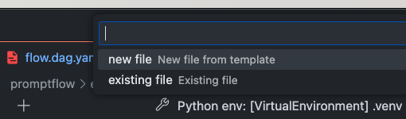
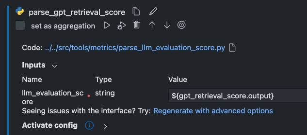
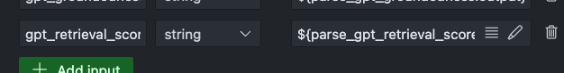

# Adding Metrics

Out of the box, AIGA supports the following metrics:

- gpt_groundedness_prompt.jinja2 -> groundedness
- gpt_retrieval_score_prompt.jinja2 -> retrieval score
- gpt_relevance_prompt.jinja2 -> relevance

AIGA provides a set of tools to make it easy to add new metrics to your flows.

## Adding a new Prompt-based metric

1. From the PromptFlow Visual Editor, click "+" and a new LLM node to the flow.

    

1. Give the node a name, and then select either a "new file" or an "existing file" for the prompt.

    

1. If you select "existing file", you will be prompted to select the file. Select a file from the "prompts" directory.

1. If you select "new file", PromptFlow will create a new file in the flow directory. See [Writing a Prompt](#writing-a-prompt) for guidance on writing a prompt.

1. The LLM node will output the LLM's response as a free-form string. AIGA provides a PromptFlow tool called `parse_llm_evaluation_score` which *loads* this string and returns a JSON object with the following keys:

    - `score`
    - `reason`

1. From the PromptFlow Visual Editor, click "+" and a new Python node to the flow. When prompted, select "existing file" and select the `parse_llm_evaluation_score` file from the "src/tools/metrics" directory.

1. Wait for PromptFlow to generate metadata for the new node. Once the metadata is generated, you can select the output of the LLM node as the input to the Python node.

    

1. Find the `concat-scores` node, and select "Add Input" to add the new metric to the concatenation.

    

1. Using the metric name as the "Input Key" and the output of the parse node as the "Input Value".

    

### Writing a Prompt

1. In order for `parse_llm_evaluation_score` to correctly parse the LLM's response, the response must be in the following format:

    ```json
    {
        "score": 0.5,
        "reason": "The LLM's response was very relevant to the prompt."
    }
    ```

1. Some LLMs provide support for specifying the JSON Schema of the response. If the LLM you are using supports this, you can specify the JSON Schema in the prompt file. For example:

    ```json
    {
        "type": "object",
        "properties": {
            "score": {
                "type": "number"
            },
            "reason": {
                "type": "string"
            }
        },
        "required": ["score", "reason"]
    }
    ```

1. However, it is more likely you will need to leverage Prompt Engineering to instruct the LLM to respond in a certain way. Below is an example of a prompt that instructs the LLM to respond in the correct format:

    ```jinja2
    system:
    You will be provided a question, fetched documents related to the question and a response to the question in the domain. You task is to ... by following the steps below:
    - ...
    - ...
    - You need to rate the provided response according to ... on a scale of 1 (poor) to 5 (excellent), based on the below criteria:
        - 5 - Ideal: ...
        - 4 - Mostly Relevant: ...
        - 3 - Somewhat Relevant: ...
        - 2 - Barely Relevant: ...
        - 1 - Completely Irrelevant: ...
    - ...
    - Your final response must include both the score and a scoring reason, according to the above criteria. The evaluation result should be written in English. Your response should be JSON in the following format:

    { "reason": "[insert score reasoning here]", "score": [insert score here] }

    user:
    # Question
    {{question}}

    # Fetched documents
    {{documents}}

    # Provided response
    {{answer}}
    ```

    > **Note:** This does not guarantee that the LLM will respond in the correct format. You may need to experiment with the prompt to get the desired response. If the LLM does not respond in the correct format, the `parse_llm_evaluation_score` tool will handle errors gracefully.
