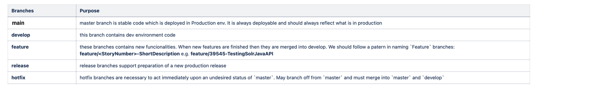

# Branching strategy

AIGA leverages two different branching strategies, one for the AIGA Template and one for AIGA Projects.

## AIGA Template

The AIGA Template repository uses a feature-based branching strategy.
As the AIGA Template is considered as a common resource and is not deployed between the different environments on its own,
we have opted to keep the branching strategy simple.

### Work process

There will be the `main` branch which everyone will checkout from for features/bug fixes etc.

- Create a new branch from `main`
- Fix/Create a feature
- Deploy to playground and test (manually/PR pipeline)
- Add documentation
- Squash merge the branch into `main`
- Run tests
- Version `main`

## AIGA Project

The first approach can also be used for an AIGA project, but in the case the team is too large and the deployments are becoming too complex to follow, there is another option for an AIGA project.
An AIGA Project will be deployed and operated in the different environments:

Dev -> Test -> Prod

Taken from the second link:

At the core, the development model is inspired by existing approaches. The central repo holds two key branches with an infinite lifetime:

- main
- develop

The `main` branch at `origin` should be familiar to every Git user. Parallel to the `main` branch, another branch exists called `develop`. We consider `origin/main` to be the primary branch where the source code of HEAD always reflects a production-ready state. Meanwhile, we consider `origin/develop` to be the branch where the source code of HEAD always reflects a state with the latest delivered development changes for the next release.

In the case there is a critical bug or problem with production which is reflected by the `main` branch, we will use the supporting branch `hotfix` to create a quick fix, test, deploy it and merge it to `main`.

The `develop` branch is updated from the `main` branch (in case of hot fixes etc.) and used to continuously deploy features and fixes. A new feature branch will be created and merged to the develop branch to allow parallel development.
Once the `develop` branch has an agreed upon set of features, we will use the supporting branch 'release' to test, deploy and merge to `main`.

In this case, we need to make sure to add the relevant triggers for the PR/CI/CD pipelines according to the relevant branches.
