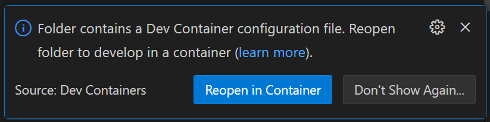
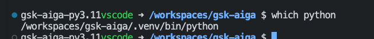

# Developer Guide

This developer guide provides the following options for setting up your development environment:

- [Manual environment set up](#manual-environment-set-up)

- [**[Recommended]** Using Dev Containers with VS Code](#recommended-using-dev-containers-with-vs-code)

After setting up your environment, you can [Validate your set up](#validating-your-set-up).

## Manual environment set up

1. Install the following pre-requisites:

    - [Python 3.9](https://www.python.org/downloads/)
    - [Node.js](https://nodejs.org/en/download/)
    - [pre-commit](https://pre-commit.com/#install)
    - [Git](https://git-scm.com/downloads)

1. Clone the repository

    ```bash
    git clone https://github.com/gsk-tech/AIGA.git
    cd AIGA
    ```

1. Install [poetry](https://python-poetry.org/). For example

    ```bash
    pip install poetry poetry-plugin-export
    ```

1. Setup dev environment

    ```bash
    make setup
    ```

## [**Recommended**] Using Dev Containers with VS Code

1. Ensure you have the pre-requisites for using Dev Containers in VS Code, such as having Docker and the Dev Containers extension installed. [Follow the tutorial](https://code.visualstudio.com/docs/devcontainers/tutorial) for instructions on installing these.

1. Clone the repository and open in VS Code

    ```bash
    git clone https://github.com/gsk-tech/AIGA.git
    cd AIGA
    code .
    ```

1. Once the repository is open in VS Code, you should see a prompt to `Reopen in Container`. (Note: If this does not appear search `>Dev Containers` in the search bar and select this option):


## Validating your set up

To check that your environment is set up correctly you can validate the following things:

1. To ensure the correct interpreter is selected you can run:

    ```bash
    which python
    ```

    You should see for example:
    

1. To check that pre-commit is correctly configured you can run the following:

    ```bash
    make pre-commit
    ```
