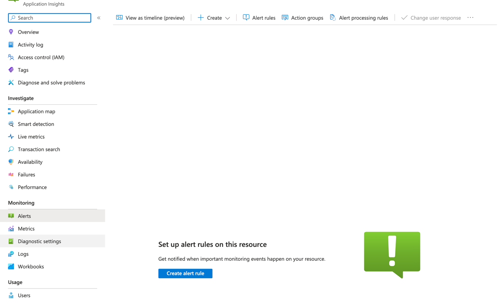

# Alerting

## Manually

In Azure portal -> App insights resource -> "Alerts" menu -> "Create alert rule", as shown in the screenshot below:



See [full documentation here.](https://learn.microsoft.com/en-us/azure/azure-monitor/alerts/alerts-create-metric-alert-rule)

Also see:
[Choosing alert type](https://learn.microsoft.com/en-us/azure/azure-monitor/alerts/alerts-types)
[Best practices](https://learn.microsoft.com/en-us/azure/azure-monitor/best-practices-alerts)

## Automatically

Using a python script:

> Note: the credentials and subscription_id should be defined before running the script.

```python
from azure.common.credentials import ServicePrincipalCredentials
from azure.mgmt.monitor import MonitorManagementClient
from azure.mgmt.monitor.models import *

# Create a MonitorManagementClient object
monitor_client = MonitorManagementClient(
    credentials=credentials,
    subscription_id=subscription_id
)

# Define the alert rule criteria
criteria = MetricAlertCriteria(
    name='PipelineRunStatus',
    metric_namespace='Microsoft.MachineLearningServices/workspaces/pipelines',
    dimensions=[
        MetricDimension(
            name='PipelineName',
            value=pipeline_name
        ),
        MetricDimension(
            name='Status',
            value='Failed'
        )
    ],
    metric_name='PipelineRunStatus',
    operator='GreaterThan',
    threshold='0',
    time_aggregation='Count',
    time_grain='PT5M'
)

# Define the alert rule action
action = AlertRuleAction(
    send_email_to_subscription_administrator=True,
    custom_emails=['<email_address>']
)

# Create the alert rule object
alert_rule = AlertRule(
    location='global',
    alert_rule_resource_id=f'/subscriptions/{subscription_id}/resourceGroups/{resource_group_name}/providers/Microsoft.MachineLearningServices/workspaces/{workspace_name}',
    description='Alert rule for failed pipeline runs',
    criteria=criteria,
    actions=[action]
)

# Create the alert rule
monitor_client.alert_rules.create_or_update(
    resource_group_name=resource_group_name,
    rule_name='FailedPipelineRuns',
    parameters=alert_rule
)
```
