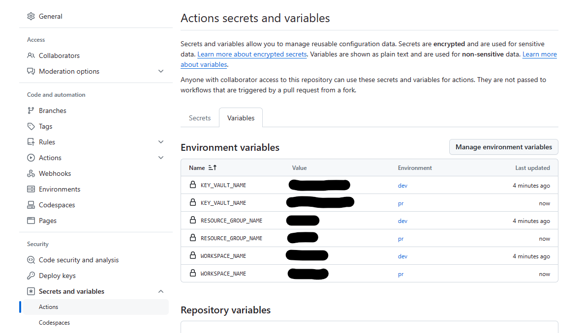

# Environment Variables

Environment variables are used within AIGA to be able to control which resources are used based on the environment (e.g. `pr`, `dev`, `prod`). These environment variables are stored as GitHub variables, which you can view, add, or edit by going to the AIGA GitHub repo, selecting **Settings** -> **Secrets and variables** (if you have sufficient permissions).

## What variables do we use?

The following variables are used to authenticate with the Azure ML Workspace:

- `SUBSCRIPTION_ID` - should point to the subscription id where the Azure ML Workspace is located.
- `KEY_VAULT_NAME` - should point to the key vault associated with Azure ML Workspace.
- `WORKSPACE_NAME` - should point to Azure ML Workspace name.
- `RESOURCE_GROUP_NAME` - should point to the resource group where the Azure ML Workspace is located

For information on what secrets are used see [Provisioning Secrets](./provisioning-secrets.md).
