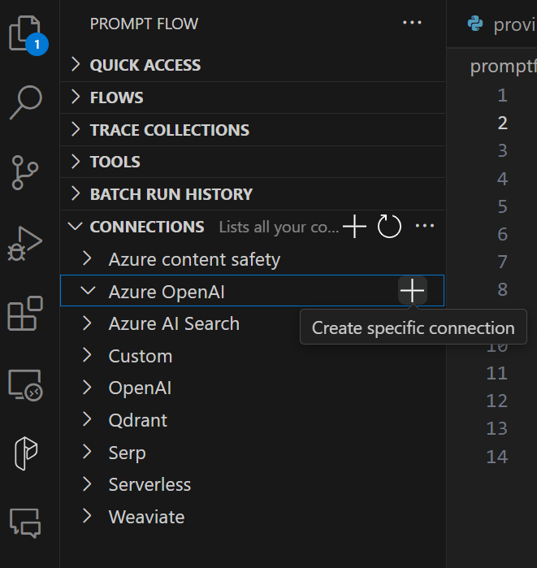
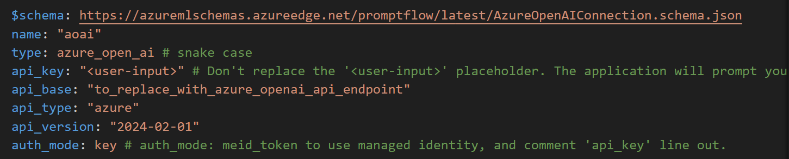

# Running PromptFlow

Chat with PDF is a simple flow that allow you to ask questions about the content of a PDF file and get answers.
You can run the flow with a URL to a PDF file and question as argument.
Once it's launched it will download the PDF and build an index of the content.
When you ask a question, it will look up the index to retrieve relevant content and post the question with the relevant content to OpenAI chat model (gpt-3.5-turbo or gpt4) to get an answer.

> Note: the full example and documentation of chat with PDF is OSS which can be found [here](https://github.com/microsoft/llmops-promptflow-template).
>
> Note: For more details on running a full E2E evaluation flow locally, please see [Experiment and Evaluate Locally](./experiment-evaluate-locally.md) documentation.

## Setup environment

Create a copy of the file [.env.example](https://github.com/gsk-tech/AIGA/tree/main/promptflow/chat_with_pdf/flows/standard/chat_with_pdf/.env.example) as a .env file in the root.
Fill the required params:

- `AOAI_API_BASE`
- `AOAI_API_KEY`
- `AISEARCH_API_BASE`
- `AISEARCH_API_KEY`

> Note: For other components such as the CI/CD, you will also need to supply the following variables: `SUBSCRIPTION_ID`, `RESOURCE_GROUP_NAME`, `WORKSPACE_NAME`

To run the environment, you can either use VSCode and the dev container supplied [in here](https://github.com/gsk-tech/AIGA/tree/main/.devcontainer)
or
install the environment [using poetry](https://python-poetry.org/docs/#installation) by running:

```bash
make setup
```

When the command finish successfully, you can perform:

```bash
poetry env list
```

and see the created environment:


To activate your environment, use one of the following:

- for Bash or Zsh (Linux, macOS, Windows Git Bash):

```bash
source .venv/bin/activate
```

- for PowerShell (Windows):

```powershell
.\.venv\Scripts\Activate.ps1
```

- for Command Prompt (Windows):

```bash
.venv\Scripts\activate.bat
```

Create PromptFlow Connections ([reference](https://microsoft.github.io/promptflow/how-to-guides/manage-connections.html#create-a-connection)). From the `inference` directory:

```bash
pf connection create -f connections/aoai.yaml --set api_key=<open-ai-api-key> --set api_base=<open-ai-api-base>
pf connection create -f connections/aisearch.yaml --set api_key=<aisearch-api-key> --set api_base=aisearch-api-base>
```

You will also need to create a connection in the Prompt Flow extension, matching the name of the Azure OpenAI resource connection defined in the flow configuration, e.g. 'aoai':



This will create a new file:



## Run standard flow

The chat with PDF receives a PDF and answer a question about it.
The flow uses the configuration in [flow.dag.yaml](https://github.com/gsk-tech/AIGA/tree/main/promptflow/chat_with_pdf/flows/standard/flow.dag.yaml).

To run it, we will use [this pdf](https://arxiv.org/pdf/1810.04805.pdf) as an example:

```bash
pf flow test --flow promptflow/inference --inputs question="What is the name of the new language representation model introduced in the document?"
```

## Run evaluation flow

The Q&A RAG evaluation flow allows you to assess and evaluate your model with the LLM-assisted metrics:

- gpt_retrieval_score: Measures the relevance between the retrieved documents and the potential answer to the given question in the range of 1 to 5:

  - 1 means that none of the document is relevant to the question at all
  - 5 means that either one of the documents or combination of a few documents is ideal for answering the given question.

- gpt_groundedness : Measures how grounded the factual information in the answers is against the fact from the retrieved documents. Even if answers is true, if not verifiable against context, then such answers are considered ungrounded.

  - Grounding score is scored on a scale of 1 to 5, with 1 being the worst and 5 being the best.

- gpt_relevance: Measures the answer quality against the preference answer generated by LLm with the retrieved documents in the range of 1 to 5:

  - 1 means the provided answer is completely irrelevant to the reference answer.
  - 5 means the provided answer includes all information necessary to answer the question based on the reference answer. If the reference answer is can not be generated since no relevant document were retrieved, the answer would be rated as 5.

The evaluation flow uses [flow.dag.yaml](https://github.com/gsk-tech/AIGA/tree/main/promptflow/chat_with_pdf/flows/evaluation/flow.dag.yaml) for its configuration.

In that file, we can see the evaluation flow is using the files:

- gpt_groundedness_prompt.jinja2 -> groundedness
- gpt_retrieval_score_prompt.jinja2 -> retrieval score
- gpt_relevance_prompt.jinja2 -> relevance

To test the evaluation flow, run:

```bash
pf flow test --flow promptflow/evaluation
```

### Create flow run with multi line data and selected metrics

To create a flow run with multi line data and selected metrics, you can use the following command:

```bash
pf run create --flow . --data ./data.jsonl --column-mapping question='${data.question}' answer='${data.answer}' documents='${data.documents}' metrics='gpt_groundedness' --stream
```

For more information on how to deploy this please see [llmops.md](llmops.md).

## Deployment names

These are the models currently used in this repo

| Model | Model deployment name | Provider | Version | Environment |
| ----- | --------------------- | -------- | ------- | ----------- |
| text-embedding-ada-002 | psc-msat-us6-text-embedding-ada-002-01 | OpenAI | 2 | dev |
| gpt-4o | gpt-4o-2024-05-13 | OpenAI | 5/13/2024 | dev |
| text-embedding-3-large | text-embedding-3-large | OpenAI | 1 | dev |
| text-embedding-3-small | text-embedding-3-small | OpenAI | 1 | dev |

Make sure you change the models' deployment names.
