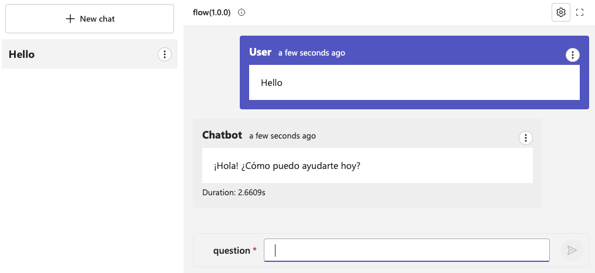

# Running with Docker

AIGA provides support to run PromptFlow inference flows in a Docker container. This provides a consistent and reliable runtime environment for running flows locally and in the cloud. The project also includes support for Docker Compose, which simplifies the control of the entire application stack, making it easy to manage services, networks, and volumes in a single.

## Notable Components

As you extend the capabilities of the PromptFlow application, it may be required to update some key Docker files. The following files are notable components of the Docker configuration:

- [Dockerfile](https://github.com/gsk-tech/AIGA/blob/main/docker/Dockerfile): Contains the instructions to build the Docker image for the PromptFlow application.
  - New dependencies can be added to the `Dockerfile` to support additional use cases.
  - Additional resources/assets can be copied into the Docker image.
- [docker-compose.yml](https://github.com/gsk-tech/AIGA/blob/main/docker/docker-compose.yml): Defines the services, networks, and volumes for the PromptFlow application stack.
  - Default build arguments can be specified in the `docker-compose.yml` file.
  - Runtime environment variables can be defined in the `docker-compose.yml` file.
- [run](https://github.com/gsk-tech/AIGA/blob/main/docker/runit/promptflow-serve/run): The `run` script is used to start the PromptFlow application in the Docker container.
  - Additional PromptFlow connections can be added to the `run` script.

## Prerequisites

- [Docker](https://docs.docker.com/get-docker/)
- [Docker Compose](https://docs.docker.com/compose/install/)

## Docker Compose

### Running with Docker Compose

1. Create an `.env` file in the `docker` directory:

    ```bash
    cp ./config/.env.example ./docker/.env
    ```

1. Update the `.env` file with the necessary environment variables. This will include secrets for access Azure AI Services.

1. Run AIGA using Docker Compose from the `docker` directory:

    ```bash
    cd docker
    docker compose up
    ```

1. Access the PromptFlow UI in your browser at [http://localhost:8080](http://localhost:8080).

    

### Building with Docker Compose

1. Docker Compose can also be used to build the Docker image. Run the following command from the `docker` directory:

    ```bash
    docker compose build
    ```

1. The Docker image will be built and tagged with the name `promptflow`.

    ```bash
    docker images
    ```

    > **Note**: The `docker-promptflow` image should be listed in the output.

1. By default, the build process will package `./promptflow/inference` into the Docker image. Build arguments can be used to specify a different directory:

    ```bash
    docker compose build \
        --build-arg USE_CASE_BASE_PATH=my-base-path \
        --build-arg FLOW_NAME=use-case-flow
    ```

    example for the evaluation:

   ```bash
    docker compose -f docker/docker-compose.yml build --build-arg USE_CASE_BASE_PATH=promptflow --build-arg FLOW_NAME=evaluation promptflow
    ```

1. Once the image is built, it can be tagged with a different name. For example:

    ```bash
    docker tag docker-promptflow registry.io/my-image-name:my-tag
    ```

## Building with Docker

1. To build the Docker image without Docker Compose, run the following command from the root of the project:

    ```bash
    docker build -t image-tag -f docker/Dockerfile .
    ```

1. Build arguments can be used to specify a different directory:

    ```bash
    docker build -t image-tag -f docker/Dockerfile . \
        --build-arg USE_CASE_BASE_PATH=my-base-path \
        --build-arg FLOW_NAME=use-case-flow
    ```

## Multiple Flows

Using Docker Compose, it is possible to run multiple PromptFlow flows as part of the same application stack. To do this, create a new service in the `docker-compose.yml` file, updating the build arguments and environment variables as necessary. For example

```yaml
services:
  promptflow-1:
    build:
      context: ..
      dockerfile: docker/Dockerfile
      args:
        - USE_CASE_BASE_PATH=promptflow
        - FLOW_NAME=inference
      platforms:
        - linux/amd64
    environment:
      - AOAI_API_BASE=${AOAI_API_BASE}
      - AOAI_API_KEY=${AOAI_API_KEY}
      - AISEARCH_API_BASE=${AISEARCH_API_BASE}
      - AISEARCH_API_KEY=${AISEARCH_API_KEY}
    ports:
      - "8080:8080"
  promptflow-2:
    build:
      context: ..
      dockerfile: docker/Dockerfile
      args:
        - USE_CASE_BASE_PATH=promptflow
        - FLOW_NAME=agent-flow
      platforms:
        - linux/amd64
    environment:
      - AOAI_API_BASE=${AOAI_API_BASE}
      - AOAI_API_KEY=${AOAI_API_KEY}
      - AISEARCH_API_BASE=${AISEARCH_API_BASE}
      - AISEARCH_API_KEY=${AISEARCH_API_KEY}
    ports:
      - "8090:8080"
```

With this configuration, after running `docker compose up`, two PromptFlow flows will be available at [http://localhost:8080](http://localhost:8080) and [http://localhost:8090](http://localhost:8090).
