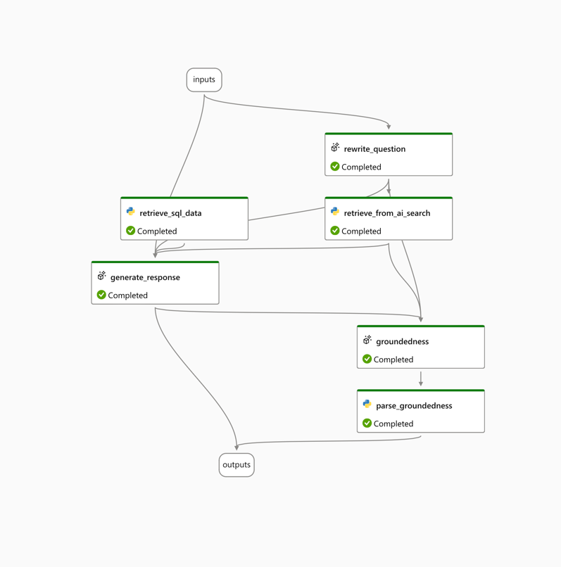
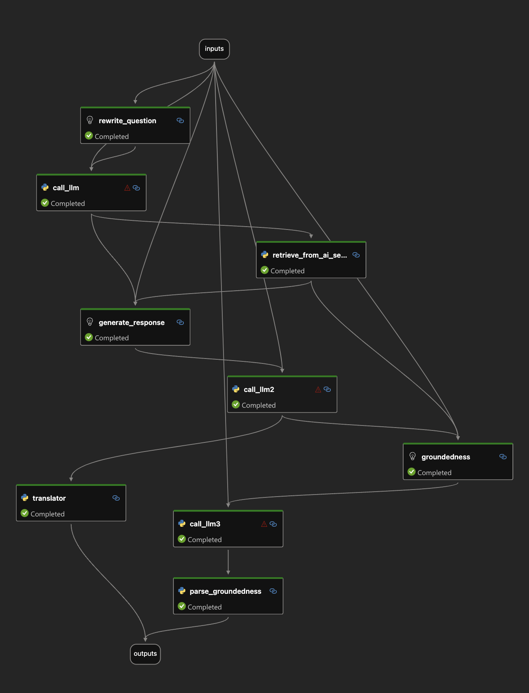

# Tools

AIGA template provide a set of reusable tools that can be seamlessly integrated into
your PromptFlow flows.
Each tool is designed to simplify common tasks, allowing you to focus on building and
refining your AI models without getting bogged down in repetitive coding tasks.

## Available Tools

### [Retrieve SQL data](https://github.com/commercial-software-engineering/AIGA/blob/main/src/tools/retrieval/retrieve_sql_data.py)

The retrieve_sql_data tool allows you to execute SQL queries directly from your AML
pipeline and retrieve the results in a structured format. This tool is particularly
useful for scenarios where you need to fetch data from SQL databases for further
processing within your machine learning workflows.
The tool is currently running as part of the promptflow inference and defined in
[flow.dag.yaml](https://github.com/commercial-software-engineering/AIGA/blob/main/promptflow/inference/flow.dag.yaml):


The tools using [query_sql.py](https://github.com/commercial-software-engineering/AIGA/blob/main/src/tools/sql/query_sql.py) class which can be
reused in other scenarios to create connection and query SQL in case needed.

> NOTE: The retrieve SQL data tool has a direct connection to your SQL but there is
> another option.
> This option requires having datastore connection and data assets in AML imported from
> SQL.
> This option has the advantages of versioning and reproducibility, better integration
> with AML pipelines, scalability and more.
> An example script on how to use the datastore and data assets:

```python
import os

from azure.ai.ml import MLClient
from azure.identity import DefaultAzureCredential
from azure.ai.ml.entities import Data
from azureml.core import Workspace
from azure.ai.ml.constants import AssetTypes

from azureml.data.azure_sql_database_datastore import AzureSqlDatabaseDatastore

datastore_name = "aigasql"

# Step 1: Authenticate to Azure and get MLClient
subscription_id = os.getenv("AML_AZURE_SUBSCRIPTION_ID")
resource_group = os.getenv("AML_RESOURCE_GROUP_NAME")
workspace_name = os.getenv("AML_WORKSPACE_NAME")

credential = DefaultAzureCredential()
workspace = Workspace(
  subscription_id=subscription_id,
  resource_group=resource_group,
  workspace_name=workspace_name
)

ml_client = MLClient(credential, subscription_id=subscription_id,
                     resource_group_name=resource_group, workspace_name=workspace_name)
# Step 2: Retrieve or create Azure SQL Datastore in AML


# Assume you have already registered this datastore in Azure ML
datastore = workspace.datastores.get(datastore_name)


# If needed we can create the datastore if it doesn't exist:
sql_datastore = AzureSqlDatabaseDatastore(
    name=datastore_name,
    server_name="your-server-name.database.windows.net",
    database_name="your-database-name",
    username="your-sql-username",
    password="your-sql-password"  # Alternatively, use a secret from a key vault
)
ml_client.datastores.create_or_update(sql_datastore)


def create_data_asset(query: str):
  sql_query = query
  data_asset_name = "aiga_test_data_asset"
  sql_data_asset = Data(
    name=data_asset_name,
    version="1",
    type=AssetTypes.MLTABLE,  # Use uri_file or uri_folder depending on the result
    path=f"azureml://datastores/{datastore_name}/paths/{sql_query}"
  )

  # Step 5: Register the Data Asset in AML workspace

  ml_client.data.create_or_update(sql_data_asset)

  print(f"Data asset {data_asset_name} created successfully.")

```

### [Azure AI Translator](https://github.com/commercial-software-engineering/AIGA/blob/src/tools/AIservices/ai_translation.py)

The ai_translation tool allows you to translate the language of your input or output any node in the flow, this uses Azure AI Translation service
to convert from one language to another.
The list of supported languages are mentioned [here](https://learn.microsoft.com/en-us/azure/ai-services/translator/language-support#translation)
The tool is currently running as part of the promptflow inference and defined in
[flow.dag.yaml](https://github.com/commercial-software-engineering/AIGA/blob/main/promptflow/inference/flow.dag.yaml):

